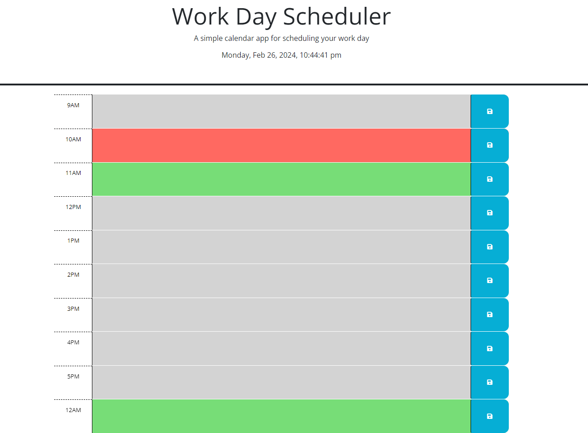
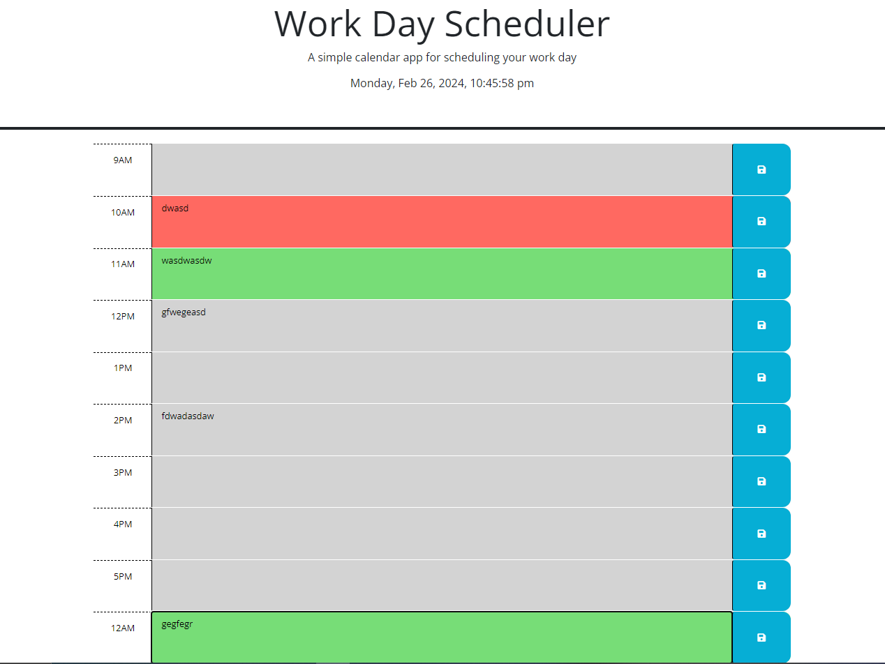

# SchedulePlann3R

## Description

The project motivation for this assignment was to make a schedule planner that functions and reacts to the time of the day. With this we tried to set a webpage that would show whether the time frame has passed or is currently upcoming (it will display different colors such as grey for past, red for present, and green for future)

due to the time of working, we can see that the time between 9AM and 5PM are currently grey'd out and unable to properly adjust to the current time. However in the picture above, adding another time slot 2 hours ahead of the current time we have the expected result of showing the green color to indicate that 12am is upcoming as the "future"

## problems

some of the problems I ran into was properly implementing a functioning clock picker through DayJS and formatting it to show the Month, Date, Year, Hour, Minute and Second. 

as seen in the picture, we can see that it shows properly as formatted. 

Another challenge was making sure the time slots sorted in the index.html would show the current time and using JS to compare the time frame to the DayJS script would determine whether it is past present or future. Assigning the else statments and reusing variables such as === , < , and > to get the expected results required a lot of trial and error to pull the proper classes and border coloring for the style.CSS file. 

Another problem I ran into was properly implementing a local storage function to recall what was written to either save on reload or erase based off of past events. Attempting to write out a simple code for local storage, it was rather difficult to find external resources on LocalStorage save processes. For the time being, this will have to suffice as just having a writing block inside the timeblocks

The easiest part of this entire assignment was just creating the time blocks for the time frames between 9AM and 5PM. following the formats as provided and ensuring that they have the same format throughout the entire time blocks was simple. 

## Usage

## credits 

Credits to the teaching instructors and staff of Columbia University Coding Bootcamp
